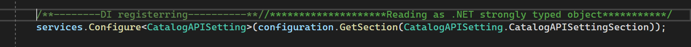
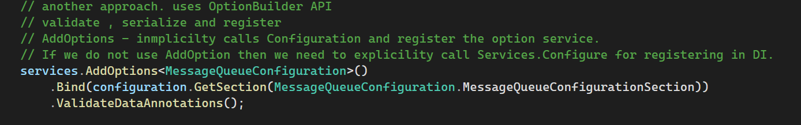

# EShopContainer 
This project is based Microsoft's eShopContainer solution.
Test commit.

###### Useful Links and Tools:
- Polly - https://github.com/App-vNext/Polly
- Microservices Design - https://microservices.io/patterns/index.html
- Ocelot - https://ocelot.readthedocs.io/en/latest/introduction/gettingstarted.html
     - Ocelot provides Polly features but it is not much customizable.
     - Better approach is use Polly and Ocelot as a separate services.
- elasticity : refers auto scaling
- Reselient Patterns and Approaches : https://github.com/peter-csala/resilience-service-design/blob/main/resilience.md#tim
- Cancellation Token :- https://medium.com/@mitesh_shah/a-deep-dive-into-c-s-cancellationtoken-44bc7664555f#:~:text=NET%20provides%202%20classes%2C%20CancellationTokenSource,all%20copies%20of%20that%20token.

###### Non-Functional Requirement
Below are the important points for Non-functional requirement which covers common for all applications.

- Security & Compilance
- Scalability
- Reliability
- Usability 
- Performance
- Network Latency 
- Maintainability
- Availability
- Disaster Recovery

---------------------------------------------------------
###### Role of Solution Architect

- Analyze Functional Requirement
- Define non functional requirement
- Understand and engage stakeholders
- Understand Constraints
- Technology Selection
- POC development
- Solution Design and Delivery

-------------------------------------------------------------------

This is a study application which will cover following major technologies and concepts.
- Cloud Native Development
- Docker
- Microservice
- Messaging Queue Pattern
- Identity Server
- REST

We will be following industry standard principles and design patterns for developing this project.

This will help us to develop solutions for different system design problems.

C# and .NET technologies are primarly used for developing this application.

###### Cloud Native and Design Standards for API Development

- API Gateway Pattern (Cloud: Azure API Gateway , On-Premise: OcelotAPI Gateway )
- Security (Azure AD, OAuth and OpenID Connect)
- API versioning 
- API Documentation - Swagger Implementation
- etry Policy
- Rate Limiter
- Load Balancer
- Circuit Breaker
- Distributed Caching

###### Low Level Code Design and Approach
- Use EFCore for Database management
- epository/Service Layer Pattern
- Seed Database from Application
- MVC Design approach
- DB Concurrency Handling via EFCore.
- Custom Middleware Implementation
- Read App config data to Typed Class.
- Custom Collection Implementation
- State management 
- Caching
---------------------------------------------------------------------------------------------
###### Swagger Implementation: (Implementation #3 , #9 )
- Swagger Help us to generate API meta data and description.
- Microsoft provides support for integrating swagger with .NET API application.
- Swagger uses the OpenAPI specification.
- The specification defines how a service should be discovered and how it's capabilities understood.
- Swagger metadata can be used by other application and it helps them quickly consume and integrate.
  - AutoRest - Helps to generate .NET classes based on swagger meta data description.
  - Microsoft Flow - Low code tool
  - Microsoft PowerApps - low code tool.
  - Azure App Service Logic Apps - low code tool.
  ---------------------------------------------------------------------------------------------
  
###### API Versioning: 
- API versioning is one of the characteristics of REST API.
- The versioning mechanism is simple and depends on the server routing the request to the appropriate endpoint.
- Use HATEOAS - HyperText as the Engine of Application State approach for implementing the versioning.
- There are different version of can be implemented.
- There are following approaches we can follow.
    - Query String
    - Request Header
    - Url segment- This is most popular and explicit approach
    - MediaType
- Implementation Types: Controller level, action method level.

------------------------------------------------------------------------------------------------
###### Options Pattern for Reading Configuration Values:(Implementation: #11)

- Option Pattern allow us to read configuration values in the form strongly typed .NET classes.
- There are two approaches for acheiving the same result.
    - Services.Configure
    - Services. AddOptions<T> -> Using OptionBuilder API

- first approach we explicitly register configuration type in DI container.
Example:

- Second approach we make use of OptionBuilder API which provides more customization, even we can implement validation while reading values from configuration files.

- Both the approaches we can make use of following interfaces for accessing the values in the application
   - IOptions<T>  - Creates Signleton services, do not support Named options(same property used for multiple binding)
   - IOptionSnapShot<T>  - Reads updated data for every request, sscoped service, supports named Options.
   - IOptionsMonitor<T>  - Monitor for value change , actually this is type of delegate, support call back events for notifying whenever value got updated in onfiguration.

-------------------------------------------------------------------
###### Pagination: 574e752b

- An Endpoint should return paginated data for best practices.
- Input parameters are page size(number of rows) and page index(page number).
- Linq provides Skip and Take extensions for performing paging related operations.
----------------------------------------------------------------------------------------

###### Docker Configuration: #18 and 176e8ea5
 1. DokcerFile - Used for building the application and produces image
 2. docker-compose.yml - provides a way for deploying multiple dockerized application in single file. images can be directly referred from docker repo or build during deployment. we can have separate docker-compose file for each environment.

 ###### Connecting local sql server from docker hosted application:
  - We can not directly connect from docker app to local sql server due to docker hosting network limitation. First , we need to ensure our local instance supports TCP/IP access and use IP address from docker instead of machine name.

 ###### Docker tips for debugging from Visual Studio 
 - Run dependency applications like API, redis, sql Server from docker.
 - Visual Studio if you are debugging specific application using docker then you should use host ip address for connecting to external services.(VS run your app inside docker host).
 
 - Visual Studio IIS express mode, you can use localhost to access the docker apps. 

 ---------------------------------------------------------------------
### Cloud Design Patterns and Problems

#### 1. Cache -A Side Pattern:
Load on demand data into cache. This approach helps to reduce the inconsistency between cached data and data store.
 - Read-through : read data from datastore if no data found in cache.
 - Write-through : invalidate data held in cache if any modification happen.

 ##### Implementation : #19
 - Redis database successfully configired and deplyed via docker.
 - By default redis listen to 6379 port inside docker's default network.
 - Map docker 6379 internal port to host machine 6379.
 - We should used Ip address of machine and 6379 as port to access redis from outside.
 - To access redis inside docker network , we can use 127.0.0.1 or localhost.
 
----------------------------------------------------------------------------------------
#### 2. Circuit Breaker Pattern:
  The Circuit Breaker pattern can prevent an application repeatedly trying to execute an operation that is likely to fail, allowing it to continue without waiting for the fault to be rectified or wasting CPU cycles while it determines that the fault is long lasting. The Circuit Breaker pattern also enables an application to detect whether the fault has been resolved. If the problem appears to have been rectified, the application can attempt to invoke the operation.
Circuit Breaker Pattern.

  - Cricuit Breaker is different from Retry Pattern , we can combine both of them.
  - Retry pattern may send a request through Circuit Breaker.
  - We will get additional advantages when combining these patterns.
  - Circuit Breaker may send a message to caller if service failure is not transient.
  - Further Retrie can be avoided.
  - It is a good practice for using Cricuit Breaker for Transient Fault Handling

  ##### State
   - Open: - Service is failed and will not process further request until resolved.
   - Half-Open : Service is recovering only limited number of requests are allowed.
   - Closed : Service is fully recovered and able to handle all the request.

    State Transistion:

     - Open -> if number of failure threshold reached.

     - Half-Open -> Open to Half-open run a timer to move the state. If service is still failing then move the state to Open. Or Circuit Breaker should be configured to ping the remote server in specific interval and based on the result to move the state to Half-Open.
     
     - Closed -> Half-Open  to Closed , If number of success request threshold reached.
     - Closed to Open :  Move the state , If number of failure request reached threshold value.
                         Count should be reset after specific time interval, there may be a situation if failure occurs occasaionally.
                         
There should be an interface provided by Circuit Breaker to move the states for administrator purpose to take control of manual override.
  
##### Best Practices and Approaches for Handling Transient Failures.
- Retry and Circuit Breaker both are reactive patterns becuase they enable or activate based response from backend service. What happen if no response or delayed response ?
- There may be situation that resources will be blocked or  increased load might occur before then.

- We need to be proactive and to have more better approach for handling transient failures.

- Timeout, Bulkead, Caching , Fallbacks are provides proactive patterns which hleps us to manager the failures more better way and provides more stability to our system.

##### TimeOut
 - Polly provides options for adding timeout to each request.
 
###### With Ocelot:
  - Ocelot provides options to include Polly but it is not customizable though.
  - Best approach here to we have to write custom Polly based policies and fuse into Ocelot middleware.
  - Ocelot provides DelegatingHandler which help us to execute logics during Http calls.
      - We should create custom delegateHandler and add the handler to Ocelot, delegating handlers are used for
       passing http request from one hanler to another handler.
 - Optimistic : 
             - honor ccancellation token- token issued to cancel the operation once timeout expired.
             - Anyway polly internally creates one cacncellation token and cancel it after timeout expired.
             - Whatever we are passed from outside, polly will check if cancellation requested or not. It cannot cancel it since it was created from outside.

 - Ocelot with Customized Polly Policeis : f430b4c70115056a1cd18a7872dd275416795bc0 
 
  ---------------------------------------------------------------------------------------

#### 3. Compensating Transaction Pattern - Similar to Saga Pattern (Microservices)
 - Our design should able to restore the state of the system if one of the steps failed.  
 - Undo the work performed by a series of steps, which together define an eventually consistent operation, if one or more of the steps fail.
 - This will be difficult problem when we embrace eventual consistency , data stored in multiple location. It is not an easy task to perform undo.
 - Not only the data , some times a service can be invoked which maintain the state. So we need to restore that as well.
 - We cannot expcet that we must perform mirror-opposite to restore the state. Some business rules has to be defined if going for undo. It may be less or more steps required than original steps.
 - Data cannot be simply rolled back , other instances of current application may change it.

 ##### Solution:
 -  Our undo process should not simply looking for performing mirror opposite steps, rather it should be intelligent process combined with business rules + take account of concurrent instance changes to restore the state.
 - Undo Process should itself embrace eventual consistency. So commands/Action for undo process must be `Idemmpotent`. We should able to execute repeately which should not impact.
 - A common approach is `WorkFlow` Process - eg: Customer placing an order, initially it will be in pending state, another service which is responsibile for managing the warhouese(warhouse service), order service should talk to warhouse and based on response it will confirm the order. 
 If no product available in warhouse then order service must inform the customer about this by cancelling the order.

- Workflow approach , each steps will be stored. So in-future it will be reverted if required.
- Some cases , it may not be possible revert the operation/state change done by original steps, in that case manual intervention required - a notification/alrt system should be placed.

##### Issues and Considerations:

- Please remember that Redo process is not generailized one , it dependes on business context which tells how many steps should execute for restore that staste . System should know about original steps.(This information must be stored somewhere/business rules should guide on this.)
- Each redo or compensating transaction must be idempotent. This will help in the cases when redo process itself fails.
##### When to Use:
- Please use Retry Pattern for transient failures, do not trigger compensating transaction.
- more complexity involved when defining the steps for redo process, it is better to have retry or timeout based mechanism on original steps before falling into compensating transaction.
- Please do not think about Compensating Transaction Pattern at first place, please avoid it.

 ----------------------------------------------------------------------------------------------

#### Competing Consumer Pattern
Enable multiple concurrent consumers to process messages received on the same messaging channel. This pattern enables a system to process multiple messages concurrently to optimize throughput, to improve scalability and availability, and to balance the workload.

- Spread the load
- Also know Queue-based Load leveling Pattern
- Multiple Consumer instances ensure that message processed consurrently.
- Messages delivered atleast once.
- Consumer instances operation should be done idempotent so that if message delivered more than once or during start/stop scenarios it will not impact the operations.
- Producer and consumer must be a separate instance.
- Some cases we may require to send the results back to producer after it was consumed.Azure provides a dedicated message reply queue for such scenarios.
- Scaling should be available for messaging queueu , If one producer sends multiple request that there should be dedicated queue for that producer.

---------------------------------------------------------------------------------------------------

#### Compute Resource Consolidation Pattern.

 Consolidate multiple tasks or operations into a single computational unit. This pattern can increase compute resource utilization, and reduce the costs and management overhead associated with performing compute processing in cloud-hosted applications.

- Reduce resource cost and management.
- It will increase resource utilization.

##### Issues and Consideration:
- A common approach is to look for tasks that have a similar profile concerning their scalability, lifetime, and processing requirements.
- Grouping these items together allows them to scale as a unit. It means we merge multiple microservices into one as single service. This should happen based on their scalability , business requirement. 

- If we group two services , S1- does the task which requires scaling , S2- always receives low traffic : in this case we should not group S1 and S2.

- For financial wise , if our resource capacity is high then we utilize it as much as possible. 

--------------------------------------------------------------------------------------

#### Command and Query Responsibility Segregation Pattern

- It help us separate Database into Read Store DB and Write Store DB.
- Reduce Conflicts while updating the database due to Optmistic locking.
- We can scale the service independently, most of the time the scaling required for read work loads.
- Enhanced security since we separated read and write models.
- Read Store and Write Store may access same physical store but as a best pratice we should different physical stores,
  this will maximize the performaance, scalability and secirity as well.
- We should embrace eventual consistency.
- As an architect first only apply this pattern to limited section and observe the result, If ok then expand further.
- To get best out of it , CQRS pattern should be used with Event Sourcing

##### Optimistic Locking : 
       - we usually read data along with version number 
         and write back if version numbers are match , if not we abort the transaction
         this is known as optimistic locking
##### Pessimistic Locking:
       - We acquire the lock first , this will prevent dirty read to be happen.

      
-------------------------------------------------------------------------------

#### Event Sourcing Pattern
- Use an append-only store to record the full series of events that describe a
ctions taken on data in a domain, rather than storing just the current state, 
so that the store can be used to materialize the domain objects.

- It will help us to avoid merge conflicts but How ? current state of the application will be updated as series
  of events like AddItemtoCart, removeItem, UpdateItem etc. Since we maintain the series of events , it should 
  be easy for us to reply the events and update the write store without merge conflicts.

- Also it will help us in implementing Compensating Transaction patter where we reacord rollback setp for each operation.

- But conflicts still be handled

##### Suits:
- Where we embrace eventual consistency.
- Avoid merge conflicts
- Using with CQRS pattern.

###### Not Suits:
  - Where we require consistency and real time update to views.

---------------------------------------------------------------
## Azure Deployment From GitHub.

#### 1. Container based deployment involving ACR
Steps :
1 - Build containers using GitHub Action Workflow.
2 - Push containers to Azure container registry.

step 1 and 2 can be an automated flow.

3 - Configure ACR task in Azure for deploying the container whenever new container pushed or manually deploy the container in App service.

#### 2. Container based deployment involving ACR- fully automated through GitHub

1 - Build and Push container to ACR
2- Pull container from ACR and deploy it on Azure app service.
3- You can create a service principal which has AcrPush and AcrPull roles assigned for authenticating to Azure ACR.
4- Additionally one more service principal or you can add role for performing deploying to Azure app service using existing service principal.

---------------------------------------------
### 3. Standard deployment for .NET apps without ACR(It applicable to both containers/non containerized apps)

1- You can generate build artifcats/containers and deploy directly on Azure app service through GitHub
2 - recommended approach for authenticating to Azure App Service is creating publish profile
3 - GitHub will use it to deploy apps on Azure
4. Service Principal and OpenID also possible.

